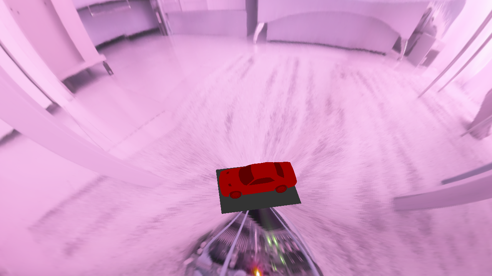
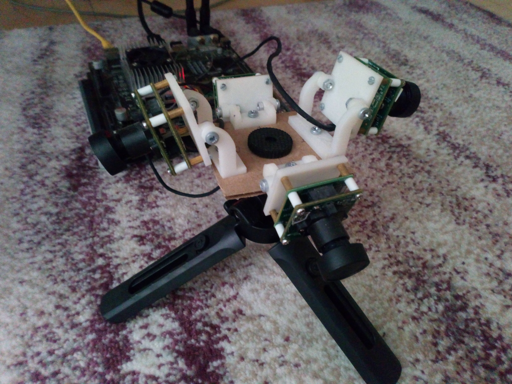
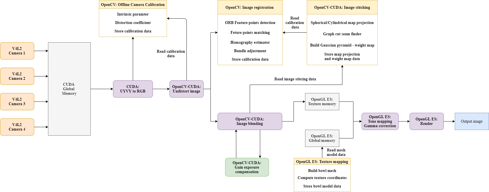

## The 3D surround view on Jetson Tegra TX2 platform - this is my research project for master thesis.
The essence of the project is to build a good quality stitching of images from 4 cameras and project the image onto a mesh model with acceptable performance. The project work on ~20 fps with constraints from the connection adaptor 30 fps due the synchronize frames mode. This is a research project, and for a production surround view application, I recommend using the [Intel/libxcam](https://github.com/intel/libxcam) library.

## Further research topics for this surround view system:
### Image quality:
* Correction distorted object in stitched image using visual odometry ([slides presentation](https://on-demand.gputechconf.com/gtc/2015/presentation/S5295-Miguel-Sainz-Timo-Stich.pdf), [paper](https://www.researchgate.net/profile/Weibo-Huang/publication/339394318_An_Online_Initialization_and_Self-Calibration_Method_for_Stereo_Visual-Inertial_Odometry/links/5e58b0b2299bf1bdb840bd59/An-Online-Initialization-and-Self-Calibration-Method-for-Stereo-Visual-Inertial-Odometry.pdf))
* Gradient domain blending ([paper](https://www.researchgate.net/profile/Kari-Pulli-2/publication/221600438_Gradient_Domain_Image_Blending_and_Implementation_on_Mobile_Devices/links/02e7e53a070e9c99d4000000/Gradient-Domain-Image-Blending-and-Implementation-on-Mobile-Devices.pdf))
* Photometric calibration ([paper](https://arxiv.org/pdf/1710.02081.pdf))
### AI integration
* Pedestrian detection
* Obstacles detection
* Automatic parking system

### The 3D bowl view:

### The top view:

### The 3D hemisphere view:

### The hardware setup:
| Device type |  Device name |
|-------------|--------------|
| Camera | e-CAM30A CUMI0330 MOD |
| Connection adaptor board | e-CAM130 TRICUTX2 ADAPTOR |
| Connecting wires | High-speed 2-lane MIPI CSI-2 |
| Embedded platform | Jetson Tegra TX2 |
| Tripod | - |

### The software setup:
* OS - Linux Ubuntu LTS v16.04
* C++ 14, Python 3.6, GLSL, C CUDA
* CMake >= v3.16
* CUDA Toolkit  v9.0
* V4L2 driver
* OpenGL ES v3.2
* OpenMP

### The data processing flowchart 

### The 3d party library:
* [OpenCV v4.1.2](https://github.com/opencv/opencv)
* [Mesa 3D (EGL, GLES)](https://docs.mesa3d.org/download.html)
* [GLM](https://github.com/g-truc/glm)
* [GLFW](https://www.glfw.org)
* [ASSIMP v4.0.1](https://www.assimp.org/index.php/downloads)
* [meshgrid](https://github.com/xiaohongchen1991/meshgen)
* [Common CUDA blender](https://github.com/Avandrea/OpenCV-BlenderGPU)

### [3D Car model](https://www.cgtrader.com/free-3d-models/car/sport/low-poly-dodge-challenger-srt-hellcat-2015)
